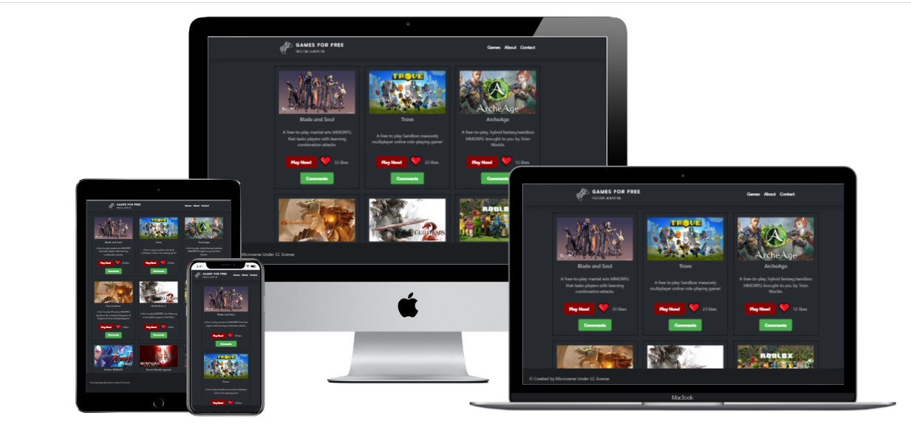

<a name="readme-top"></a>

<div align="center">

</div>

<!-- TABLE OF CONTENTS -->

# 📗 Table of Contents

- [📖 About the Project](#about-project)
  - [🛠 Built With](#built-with)
    - [Tech Stack](#tech-stack)
    - [Features](#features)
  - [🚀 Live Demo](#live-demo)
- [💻 Getting Started](#getting-started)
  - [Setup](#setup)
  - [Prerequisites](#prerequisites)
  - [Install](#install)
  - [Usage](#usage)
  - [Run tests](#run-tests)
  - [Deployment](#triangular_flag_on_post-deployment)
- [👥 Authors](#authors)
- [🔭 Future Features](#future-features)
- [🤝 Contributing](#contributing)
- [⭐️ Show your support](#support)
- [🙏 Acknowledgements](#acknowledgements)
- [❓ FAQ](#faq)
- [📝 License](#license)

<!-- PROJECT DESCRIPTION -->

# 📖 Games For Free <a name="about-project"></a>

<div align="center">

  
  <br/>

</div>


**Games For Free** is a website dedicated to providing a wide range of free games for users to enjoy. The site offers a diverse selection of games in various genres, including action, adventure, puzzle, sports, and more. The games are accessible to all users and are designed to provide a fun and enjoyable gaming experience. Users can easily browse through the site to find their favorite games, which are updated regularly to provide fresh and exciting content. Whether you are a casual or avid gamer, "Games For Free" offers a fun and engaging platform for you to play games without having to pay a cent.

## 🛠 Built With <a name="built-with"></a>

### Tech Stack <a name="tech-stack"></a>

<details>
  <summary>Client</summary>
  <ul>
    <li><a href="https://webpack.js.org/">Webpack</a></li>
    <li>JavaScript (ES6+)</li>
  </ul>
</details>
<details>
<summary>API</summary>
  <ul>
    <li><a href="https://rapidapi.com/">RapidAPI</a></li>
  </ul>
</details>

<!-- Features -->

### Features <a name="features"></a>

- **See game information:** Users can view information about the game, such as its title, description, and rating.
- **View game image:** Users can see an image of the game to get a better idea of what it looks like.
- **Access game URL:**  Users can easily access the URL to play the game directly from the application.

<p align="right">(<a href="#readme-top">back to top</a>)</p>

<!-- LIVE DEMO -->

## 🚀 Live Demo <a name="live-demo"></a>


- [Live Demo Link](https://free2playzone.netlify.app)

<p align="right">(<a href="#readme-top">back to top</a>)</p>

<!-- GETTING STARTED -->

## 💻 Getting Started <a name="getting-started"></a>

To get a local copy up and running, follow these steps.

### Prerequisites

In order to run this project you need:

<!--
Example command:

```sh
 gem install rails
```
 -->

### Setup

Clone this repository to your desired folder:

<!--
Example commands:

```sh
  cd my-folder
  git clone git@github.com:myaccount/my-project.git
```
--->

### Install

Install this project with:

<!--
Example command:

```sh
  cd my-project
  gem install
```
--->

### Usage

To run the project, execute the following command:

<!--
Example command:

```sh
  rails server
```
--->

### Run tests

To run tests, run the following command:

<!--
Example command:

```sh
  bin/rails test test/models/article_test.rb
```
--->

### Deployment

You can deploy this project using:

<!--
Example:

```sh

```
 -->

<p align="right">(<a href="#readme-top">back to top</a>)</p>

<!-- AUTHORS -->

## 👥 Authors <a name="authors"></a>

👤 **Alejandro Velasquez**

- GitHub: [@VelzckC0D3](https://github.com/VelzckC0D3)
- LinkedIn: [LinkedIn](https://linkedin.com/in/VelzckC0D3)

👤 **Marco Almada**

- GitHub: [@MarcoDDM](https://github.com/MarcoDDM)
- LinkedIn: [LinkedIn](https://linkedin.com/in/marcoalmadaar)

<p align="right">(<a href="#readme-top">back to top</a>)</p>

<!-- FUTURE FEATURES -->

## 🔭 Future Features <a name="future-features"></a>


- [ ] **User Registration:** Allow users to register for an account and save their game progress and scores.
- [ ] **Online Gaming:**  Enable users to play games online with others in real-time.
- [ ] **Social Media Integration:** Allow users to share their achievements and progress on social media platforms.

<p align="right">(<a href="#readme-top">back to top</a>)</p>

<!-- CONTRIBUTING -->

## 🤝 Contributing <a name="contributing"></a>

Contributions, issues, and feature requests are welcome!

Feel free to check the [issues page](../../issues/).

<p align="right">(<a href="#readme-top">back to top</a>)</p>

<!-- SUPPORT -->

## ⭐️ Show your support <a name="support"></a>

If you like this project give us a star and hire us...

<p align="right">(<a href="#readme-top">back to top</a>)</p>

<!-- ACKNOWLEDGEMENTS -->

## 🙏 Acknowledgments <a name="acknowledgements"></a>

A big thank you to Jorlanio for his tremendous help throughout the project.

<p align="right">(<a href="#readme-top">back to top</a>)</p>

<!-- LICENSE -->

## 📝 License <a name="license"></a>

This project is [MIT](./LICENSE) licensed.

_NOTE: we recommend using the [MIT license](https://choosealicense.com/licenses/mit/) - you can set it up quickly by [using templates available on GitHub](https://docs.github.com/en/communities/setting-up-your-project-for-healthy-contributions/adding-a-license-to-a-repository). You can also use [any other license](https://choosealicense.com/licenses/) if you wish._

<p align="right">(<a href="#readme-top">back to top</a>)</p>
